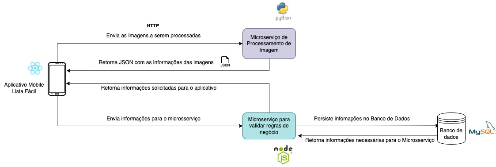

# NodeJS API
API feita em NodeJS para cadastrar e gerenciar lista de compras no fluxo de um trabalho de conclusão de curso!

Arquitetura Macro do Projeto: 



## Tecnologias

1 - NodeJS
2 - Express
3 - Prisma (ORM)
4 - PostgreeSQL 
5 - Docker

## Como Rodar o projeto

1 - Clone este repositório
```shell
git clone git@github.com:NicolasPereira/nodejs-api-tcc.git
```

2 - Build a imagem
```shell
docker-compose build image -d
```

3 - O serviço estara rodando na porta `3000`

4 - Para parar a aplicação

```shell
docker-compose down
```

5 - Para iniciar a aplicação após a imagem já estar buildada
```shell 
docker-compose up
```